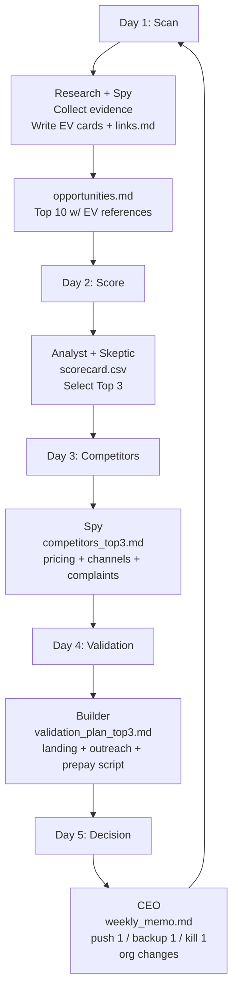

# Research Agent Architecture for an OpenClaw + vLLM Multi-Agent “Company” System

## Executive summary

This report specifies a deployable, cost-optimized **v1** architecture for a multi-agent “company” built on **OpenClaw (HQ Gateway on a VPS)** plus **vLLM (GPU inference nodes)**, with a **file-first shared workspace** as the source of truth. It is designed to (a) run an evidence-driven weekly business loop, (b) keep token usage bounded and observable, and (c) harden the system against common failure modes like context bloat and tool-chain token exhaustion. citeturn9search12turn2search2turn1academia37

Key v1 cost levers:
- Use **one GPU node** (14B worker) and **no 32B** initially; only add 32B when you have a stable workflow and clear escalation triggers. citeturn2search0turn2search1  
- Move heavy background work to **isolated cron jobs** (fresh session per run) and keep heartbeat minimal. citeturn2search1turn2search9  
- Cap output by role with **provider `maxTokens`** (and keep bootstrap files short), because OpenClaw injects bootstrap files every turn. citeturn2search2turn2search9turn2search0  
- Turn on vLLM **Automatic Prefix Caching** to reuse shared prefixes across many agent turns. citeturn3search0turn3search19  
- Enable observability early: OpenClaw supports JSONL logs and OpenTelemetry export with explicit token/run/queue metrics. citeturn10view0turn10view1  

Optional “optimizer tools” you requested:
- **OpenViking** can act as a context database (file-system paradigm) to reduce ad-hoc context management and help agents retrieve hierarchical context. citeturn1search0turn1search9  
- **EvoMap** can be treated as an external “playbook gene bank” (GEP: genes/capsules) for sharing/consuming validated strategies—useful, but it introduces privacy/egress concerns and (depending on plan) ongoing cost. citeturn1search12turn1search1  

Unspecified details (explicitly not assumed): your VPS size, GPU type/provider, storage backend, and whether you want public inbound webhooks vs outbound-only. The design below is provider-agnostic and uses private networking + allowlists as defaults. citeturn8view2turn9search12  

## Overall architecture and component roles

### Labeled architecture diagram (PNG + SVG)

**Download:**  
- [Architecture diagram (PNG)](sandbox:/mnt/data/openclaw_vllm_company_architecture_v1.png)  
- [Architecture diagram (SVG)](sandbox:/mnt/data/openclaw_vllm_company_architecture_v1.svg)


### Component list and purpose

**HQ VPS (always-on control plane)**  
- **OpenClaw Gateway**: the single long-running routing/control-plane process (sessions, routing, cron scheduler, command queue, tool policy). It is designed loopback-first and commonly accessed via SSH tunnel or tailnet/VPN. citeturn8view2turn9search12turn2search1  
- **Shared workspace volume** (file-first system of record): houses evidence cards (EV snippets), weekly opportunities list, scorecard, validation assets, and memos. OpenClaw injects certain workspace “bootstrap files” every turn; the shared “company” artifacts should be read on-demand to control token use. citeturn2search2turn2search9  
- **Redis (optional)**: **not required** for OpenClaw’s internal command queue / session lanes, but useful for (a) write-locks on shared documents, (b) rate-limit counters, (c) dedupe caches, (d) optional external workers. OpenClaw already provides an internal queue with per-session lanes and no external dependencies. citeturn9search0turn2search1  
- **Nginx/Caddy (optional)**: only if you must do TLS termination or rate limiting at the edge. For cost + simplicity, v1 often uses loopback bind + SSH/VPN and no public exposure. citeturn8view2turn9search12  
- **Monitoring/logging**: OpenClaw supports JSONL file logs and OpenTelemetry export (diagnostics-otel) with token/run/queue metrics. citeturn10view0turn10view1  

**GPU node(s) (inference plane)**  
- **vLLM 14B server (primary)**: OpenAI-compatible `/v1` API. Enable prefix caching for repeated system prefixes and stable prompt blocks. citeturn1search2turn3search0turn3search19  
- **vLLM 32B server (optional)**: started only when escalation triggers fire (see routing rules). citeturn2search0turn2search1  
- **Metrics**: vLLM’s Prometheus metrics endpoint is available (examples show `/metrics`), and “Prometheus metric logging is enabled by default in the OpenAI-compatible server” in vLLM docs/examples. citeturn3search1turn3search5  

**Optional optimizers (phase 2)**  
- **OpenViking**: open-source context database for agents (file system paradigm) intended to unify memories/resources/skills and reduce manual context handling. citeturn1search0turn1search9  
- **EvoMap**: external infrastructure for “AI self-evolution” via GEP assets (genes/capsules) with ranking/scoring and an A2A hello endpoint; pricing is credit-based with a free tier but paid plans unlock more (e.g., KG query). citeturn1search12turn1search1  

## Network topology and security controls

### Network topology (recommended v1)

**Principle:** Control plane private-first; inference plane strictly allowlisted.

- **Gateway bind mode**: OpenClaw defaults loopback-first (WS control plane `ws://127.0.0.1:18789`), and remote use is typically SSH tunnel or tailnet/VPN. citeturn8view2turn9search12  
- **Gateway authentication**: tokens are required for non-loopback binds; docs explicitly call out using `--bind tailnet --token ...` and that the wizard generates a token by default. citeturn8view2turn6search3turn9search12  
- **vLLM accessibility**: expose vLLM only on a private subnet; restrict inbound to the HQ VPS IP (security group / firewall). OpenClaw’s vLLM provider docs assume `/v1` endpoints and commonly reference `http://127.0.0.1:8000/v1` as a baseline. citeturn8view1  

### Access control and tool least privilege

**OpenClaw’s security stance:** “Identity first, scope next, model last,” assuming models can be manipulated; lock down who can message the bot, then restrict tool scope and sandboxing. citeturn5search11turn5search35  

Concrete controls:
- **DM policy**: use “pairing” (default) or “allowlist”; avoid “open” for tool-enabled agents. citeturn5search35turn5search11  
- **Tools allow/deny**: OpenClaw supports tool groups (e.g., `group:runtime`, `group:fs`, `group:web`) and deny wins; use this to hard-disable `exec` for Research/Spy/Analyst in v1. citeturn2search3  
- **Sandboxing**: OpenClaw can run tools inside Docker containers to reduce blast radius; it is optional and “not a perfect security boundary” but materially limits damage when the model does something unsafe. citeturn8view3  
- **Per-agent credential separation**: multi-agent setups provide each agent its own agentDir and session store under `~/.openclaw/agents/<agentId>`; per-agent auth profile stores are referenced in multi-agent tool/sandbox guidance. citeturn5search0turn7search22  
- **Audit trail**: OpenClaw logs can include tool summaries, URLs, and transcripts; recommended audits include reviewing `/tmp/openclaw/openclaw-YYYY-MM-DD.log` and session transcripts under `~/.openclaw/agents/<agentId>/sessions/*.jsonl`. citeturn10view1turn9search11  

### Token-exhaustion threat model (why these controls matter)

The Clawdrain paper demonstrates **6–7× token amplification** (and up to ~9× in a costly configuration) via a Trojanized skill and multi-turn protocol, and identifies deployment vectors including **SKILL.md prompt bloat**, **persistent tool-output pollution**, and **cron/heartbeat frequency amplification**. citeturn1academia37  

Your v1 architecture should treat token budgets as a security boundary (not just a cost control): restrict tool surfaces, reduce background frequency, and cap outputs.

## Data flows and per-agent workspace/file contracts

### Shared “company workspace” contract (file-first)

OpenClaw injects certain bootstrap files every turn; large files are truncated per-file and capped in total injection, and daily `memory/*.md` is **not auto-injected** (on-demand via memory tools). This makes it practical to keep “always-injected files” short and keep large evidence under `company/` folders. citeturn2search2turn2search9  

**Recommended shared workspace tree (example)**
- `company/tasks/` — task tickets (the only input contract)
- `company/evidence/links.md` — source index
- `company/evidence/snippets/EV-*.md` — EV cards (append-only)
- `company/weekly/opportunities.md` — top 10 opportunities (Day 1 output)
- `company/analysis/scorecard.csv` — scoring (Day 2 output)
- `company/validation/…` — landing copy, outreach scripts, survey, pricing page
- `company/weekly/weekly_memo.md` — CEO decision memo (Day 5 output)

### EV card format (token-efficient evidence unit)

A minimal EV card should be readable in ~10–20 lines; the goal is to avoid pasting large web content into chats and avoid repeated page re-reading.

Suggested EV schema:
- `claim:` one-sentence claim
- `source:` URL + publisher/site
- `date:` publication date (if known)
- `excerpt:` 1–3 short quotes (tight)
- `why_it_matters:` how it supports “pain” or “willingness to pay”
- `confidence:` A/B/C
- `tags:` buyer persona, channel, pain type

This file-first evidence approach is directly aligned with OpenClaw’s token accounting model: tool outputs, attachments, and system prompt content all count in the context window. citeturn2search2turn2search9  

### Weekly workflow (Mermaid flowchart)



### Agent-by-agent contracts and token-saving rules (v1)

Tool policies are the most practical way to enforce least privilege; OpenClaw supports global/per-agent tool profiles and allow/deny lists (including tool groups). citeturn2search3turn8view3  

**CEO / Router**
- Inputs: new requests + completed artifacts + QA feedback
- Outputs: `company/weekly/weekly_memo.md`, “Push/Backup/Kill” decisions
- Token rules:  
  - Keep CEO chat short; read files for details  
  - Escalate to 32B only when triggers fire (below)  
- Tools: allow file tools; deny runtime by default; enable higher-risk tools only in explicit “maintenance” sessions.

**Research Agent**
- Inputs: TASK for the week’s theme + constraints
- Outputs: EV cards + `opportunities.md`
- Token rules: run via **isolated cron** for scanning (fresh session each run, no history carry-over). citeturn2search1  
- Tools: allow `group:fs` + `group:web` only; deny `group:runtime` (exec/process). citeturn2search3  

**Customer Spy**
- Outputs: competitor/pricing/channel docs, plus EV cards for “real user pain”
- Token rules: same as Research; isolate via cron when doing large scans.

**Business Analyst**
- Outputs: `scorecard.csv`, `unit_econ.md` (optional)
- Token rules: small outputs; work from EV cards rather than re-fetching sources.

**Builder**
- Outputs: within `company/validation/` (landing copy, outreach scripts, questionnaire)
- Token rules: higher output budget; still bounded.
- Tools: may require browser/web fetch; keep runtime tools off unless sandboxed.

**Skeptic / QA**
- Outputs: rejection notes referencing missing evidence or risk items
- Token rules: short and structured; “reject reason → file path → fix request”

## Model routing and token optimization (cost-optimized v1)

### Model routing rules and escalation triggers

OpenClaw’s vLLM provider docs explicitly recommend manual provider configuration when you want to **pin `contextWindow`/`maxTokens`**. citeturn8view1  

**Default:** 14B worker model for all roles.  
**Escalate to 32B only when at least one trigger is true:**
- CEO is writing `weekly_memo.md` or any external-facing “final” artifact
- Skeptic rejects the same work twice
- The decision requires multi-constraint synthesis (pricing + legal + execution + competition)
- Evidence is conflicting and requires careful reconciliation

This matches the intended use of “optional 32B” as a sparingly used decision engine.

### v1 token optimization checklist (highest-leverage levers)

1) **Use isolated cron for scanning/background chores**  
Isolated cron runs start a fresh session each time; `delivery.mode = none` keeps the run internal with no main-session summary. This is ideal for noisy tasks that would otherwise bloat your main session and burn tokens over time. citeturn2search1  

2) **Keep bootstrapped workspace files extremely short**  
OpenClaw injects `AGENTS.md`, `SOUL.md`, `TOOLS.md`, `USER.md`, etc. on every turn. Large files are truncated per-file and capped in total; daily memory files are not auto-injected. Use this to keep “always injected” content tiny and store big artifacts under `company/`. citeturn2search9turn2search2  

3) **Cap outputs with provider `maxTokens` by role**  
This is the simplest hard stop against “runaway verbosity” and accidental token loops; OpenClaw manual model config explicitly supports `maxTokens`. citeturn8view1turn2search4  

4) **Enable vLLM Automatic Prefix Caching**  
APC caches KV for prefixes; if most agent turns share stable system prefixes, it reduces redundant computation. citeturn3search0turn3search19  

5) **Disable surprise sampling defaults from `generation_config.json` (optional but recommended for reproducibility)**  
vLLM applies `generation_config.json` by default if present; docs describe disabling this with `--generation-config vllm`. citeturn4search0turn4search7  

6) **Add token-drain guardrails informed by Clawdrain**  
Clawdrain highlights prompt bloat and tool-output pollution plus cron/heartbeat amplification; treat these as test cases (see bench plan) and set guardrails (smaller `maxTokens`, cron over heartbeat, tool deny by default). citeturn1academia37turn2search3  

### Model comparison table (7B / 8B / 14B / 32B)

Below is a practical “what runs where” table focused on **cost, latency, and token efficiency** for your architecture. Context lengths are cited from model cards/discussions; actual throughput depends on your GPU, quantization, and max context. citeturn1search8turn8search0turn7search0turn7search3  

| Size tier | Example model family | Context length (as documented) | Cost profile (self-host) | Latency / throughput profile | Token efficiency tactics | Recommended use in your “company” |
|---|---|---:|---|---|---|---|
| 7B | Mistral 7B Instruct (example) | Up to ~32k is referenced in HF discussions for v0.2; confirm exact variant | Lowest GPU cost; can run on smaller/cheaper GPUs | Fastest among listed tiers | Aggressive `maxTokens`; cron-only scanning; summarize to EV cards | Ultra-cheap scanning, extraction, dedupe, formatting EV cards |
| 8B | Qwen3-8B | Native 32,768; YaRN validated to 131,072 | Low cost, good balance | Very good speed; usually strong enough for extraction + light synthesis | Keep context small; APC helps; cap outputs | “Cheap worker” for Research/Spy in strongest cost-saving modes |
| 14B | Qwen3-14B | Native 32,768; YaRN validated to 131,072 | Medium cost; still feasible single-GPU depending on settings | Slower than 8B but more robust synthesis | APC + strict output caps + file-first | Default v1 primary across roles (recommended balance) |
| 32B | Qwen3-32B | YaRN validated to 131,072 (needs confirm per deployment) | Highest cost | Slowest; more VRAM pressure | Use only on escalations; keep prompts stable; strict `maxTokens` | CEO decision memos; “hard tradeoffs”; QA repeated failures |

Model-card citations for Qwen3 context lengths: Qwen3-8B and Qwen3-14B both state native 32,768 and YaRN validation to longer contexts. citeturn7search0turn8search0  
Qwen3-32B also references YaRN validation in its README. citeturn7search3  

**Cost-optimized v1 recommendation:** deploy **only one model server** (14B) first; keep 32B off until you have stable scoring/validation loops. If you must be extremely cost-sensitive, run Research/Spy on an 8B model and reserve 14B for CEO/Analyst/Builder. citeturn2search1turn2search0turn7search0turn8search0  

## Deployment artifacts, ports, firewall rules, and cron examples

### Downloadable deployment artifacts (generated)

- [docker-compose.hq.yml](sandbox:/mnt/data/docker-compose.hq.yml)  
- [vllm-14b.start.sh](sandbox:/mnt/data/vllm-14b.start.sh)  
- [COMPANY_CHARTER.md](sandbox:/mnt/data/COMPANY_CHARTER.md)

### Ports and network rules (v1 baseline)

OpenClaw defaults:
- Gateway runs on port **18789** by default; loopback-first. citeturn8view2turn9search12  

vLLM defaults in examples:
- vLLM commonly runs on port **8000** with `/v1` endpoints. citeturn8view1turn1search2  

Typical internal services (optional):
- Redis: 6379 (keep private, no public exposure)

| Component | Port | Exposure rule (recommended) | Source |
|---|---:|---|---|
| OpenClaw Gateway | 18789/TCP | Bind loopback; access via SSH tunnel or VPN/tailnet | citeturn8view2turn9search12 |
| vLLM 14B | 8000/TCP | Private subnet; inbound allowlist = HQ VPS IP only | citeturn8view1turn1search2 |
| vLLM 32B | 8000/TCP (separate host) | Same rule as 14B; start on demand | citeturn2search0turn2search1 |
| Redis (optional) | 6379/TCP | Private only; allow HQ only | (standard practice; optional component) |

### OpenClaw provider config snippet (vLLM manual models)

Use explicit vLLM provider config when: different host/port, or to pin `contextWindow/maxTokens`. citeturn8view1  

```json5
// ~/.openclaw/openclaw.json (snippet)
{
  models: {
    providers: {
      vllm: {
        baseUrl: "http://<GPU_PRIVATE_IP>:8000/v1",
        apiKey: "${VLLM_API_KEY}",
        api: "openai-completions",
        models: [
          {
            id: "Qwen/Qwen3-14B",
            name: "vLLM 14B worker",
            reasoning: false,
            input: ["text"],
            cost: { input: 0, output: 0, cacheRead: 0, cacheWrite: 0 },
            contextWindow: 32768,
            maxTokens: 1200
          }
        ]
      }
    }
  },

  agents: {
    defaults: {
      model: { primary: "vllm/Qwen/Qwen3-14B" },
      // Keep bootstrapped files small; daily memory is on-demand.
      bootstrapMaxChars: 20000,
      bootstrapTotalMaxChars: 150000
    },

    list: [
      { id: "ceo", name: "CEO/Router", model: { primary: "vllm/Qwen/Qwen3-14B" } },
      { id: "research", name: "Research", model: { primary: "vllm/Qwen/Qwen3-14B" } },
      { id: "spy", name: "Spy", model: { primary: "vllm/Qwen/Qwen3-14B" } },
      { id: "analyst", name: "Analyst", model: { primary: "vllm/Qwen/Qwen3-14B" } },
      { id: "builder", name: "Builder", model: { primary: "vllm/Qwen/Qwen3-14B" } },
      { id: "skeptic", name: "Skeptic/QA", model: { primary: "vllm/Qwen/Qwen3-14B" } }
    ]
  },

  // Example tool policies: allow fs + web for research agents; deny runtime by default.
  tools: {
    allow: ["group:fs", "group:web"],
    deny: ["group:runtime"]
  }
}
```

Tool-group support and allow/deny behavior are documented in OpenClaw tools policy docs. citeturn2search3  
Bootstrap/token injection behavior is documented in OpenClaw token-use and system prompt docs. citeturn2search2turn2search9  

### vLLM start script snippet (14B worker)

vLLM provides an OpenAI-compatible server started via `vllm serve`, and docs describe disabling `generation_config.json` defaults with `--generation-config vllm`. citeturn1search2turn4search0  

```bash
#!/usr/bin/env bash
set -euo pipefail

MODEL_ID="${MODEL_ID:-Qwen/Qwen3-14B}"
PORT="${PORT:-8000}"
API_KEY="${VLLM_API_KEY:-vllm-local}"

vllm serve "${MODEL_ID}" \
  --host 0.0.0.0 \
  --port "${PORT}" \
  --api-key "${API_KEY}" \
  --dtype auto \
  --enable-prefix-caching \
  --generation-config vllm
```

Prefix caching (APC) is documented as reusing KV cache for shared prefixes and can be enabled via engine args. citeturn3search0turn3search19  

### Cron job examples (token-efficient automation)

Isolated cron jobs:
- run in `cron:<jobId>`
- start a fresh session each run (no prior conversation carryover)
- can deliver `announce/webhook/none`, and `none` runs internal-only. citeturn2search1  

Example: Monday 09:00 scan (isolated, internal-only, produces files only)

```bash
openclaw cron add \
  --name "Weekly Scan (Research)" \
  --cron "0 9 * * 1" \
  --tz "America/Los_Angeles" \
  --session isolated \
  --agent research \
  --message "Run Day-1 scan. Update company/evidence/snippets with EV cards, then write company/weekly/opportunities.md. No chat output except STATUS+files written." \
  --no-deliver
```

(If your CLI differs, the underlying cron behaviors—fresh session per run, internal-only delivery mode—are documented in cron jobs docs.) citeturn2search1  

## Monitoring, logging, and operational discipline

### OpenClaw logging + diagnostics

OpenClaw:
- writes JSONL file logs (default under `/tmp/openclaw/openclaw-YYYY-MM-DD.log`)
- supports `openclaw logs --follow`
- can export metrics/traces/logs via the `diagnostics-otel` plugin over OTLP/HTTP. citeturn10view1turn10view0  

The exported metrics include token and context measurements plus queue depth/wait and run duration (useful to validate token optimization and detect runaway loops). citeturn10view0  

### vLLM metrics

vLLM provides Prometheus metrics and examples show `/metrics`; docs/examples state Prometheus metric logging is enabled by default in the OpenAI-compatible server. citeturn3search1turn3search5  

For architecture health:
- Track request queueing, latency, throughput, and GPU saturation
- Validate APC benefit by comparing TTFT/latency with repeated-prefix workloads. citeturn3search0turn3search5  

### Operational commands to keep in your “runbook”

OpenClaw has clear command ladders for day-1 and day-2 ops; health checks include `openclaw status`, `openclaw gateway status`, and `openclaw health --json`. citeturn9search12turn9search2  

## Benchmark and validation plan for this architecture

You asked for benchmark tests to validate the architecture. The goal here is to validate **three layers**: (1) control-plane correctness, (2) inference-plane performance, and (3) token/cost stability.

### Control-plane and security validation (OpenClaw)

**Gateway availability**
- Run `openclaw gateway status` and confirm `Runtime: running` and `RPC probe: ok` is the healthy baseline. citeturn9search12  
- Run `openclaw health --json` for a full snapshot probe. citeturn9search2  

**Remote access correctness**
- Confirm gateway bind is loopback-first and remote access is via SSH tunnel or tailnet/VPN. citeturn8view2turn9search12  

**Tool policy enforcement**
- Attempt to use a denied runtime tool (e.g., `exec`) from Research/Spy sessions; confirm it is blocked (deny wins). citeturn2search3  

### Token-efficiency validation (OpenClaw)

**Baseline system prompt “tax”**
- Use `/context detail` to measure the per-turn token cost of injected bootstrap files and tool schema overhead, then trim `AGENTS.md/SOUL.md/TOOLS.md/MEMORY.md` until stable. citeturn2search9turn2search2  

**Cron isolation vs heartbeat pollution**
- Run a scanning job as **isolated cron** and confirm:
  - job starts fresh session each run
  - no carryover bloats the CEO main session
  - `delivery.mode=none` creates no main-session summary spam. citeturn2search1  

**Token-spend observability**
- Enable OpenClaw diagnostics-otel and verify you can observe:
  - `openclaw.tokens` and `openclaw.context.tokens`
  - `openclaw.run.duration_ms`
  - queue depth/wait metrics. citeturn10view0  

### Inference performance validation (vLLM)

**Functional API smoke**
- `GET /v1/models` from HQ VPS to vLLM base URL confirms connectivity (OpenClaw vLLM provider doc explicitly suggests curling `/v1/models`). citeturn8view1turn4search10  

**Prefix caching benchmark (APC effectiveness)**
- Run two load tests of repeated-prefix prompts:
  1) `--enable-prefix-caching` ON  
  2) OFF  
- Compare TTFT/request latency and throughput; APC is designed to reuse KV cache for shared prefixes and skip computing shared parts. citeturn3search0turn3search4  

**Load test using vLLM’s benchmarking tooling**
- vLLM’s Prometheus/Grafana example references `benchmarks/benchmark_serving.py` and demonstrates that raw metrics are visible at `/metrics`. citeturn3search1  
- Use that benchmark to sweep request rate (e.g., 1 rps → 10 rps) and record:
  - queue buildup (waiting requests)
  - p50/p95 latency
  - error rates
  - resource headroom

### Token-drain resilience test (defensive)

Without reproducing a real malicious skill, you can still test the architectural mitigations suggested by Clawdrain:

- Create a **synthetic prompt bloat** condition (e.g., temporarily enlarge a non-critical bootstrap file) and verify:
  - context/token metrics spike is visible
  - `/context detail` shows which file contributes
  - your caps (`maxTokens`) prevent runaway completion lengths. citeturn1academia37turn2search9turn10view0  

- Create a **synthetic tool-output pollution** condition:
  - force a tool to return a large output (e.g., fetch a big page)
  - verify that subsequent runs do not repeatedly re-ingest that output (your EV-card approach should keep tool outputs out of chat and in files). citeturn1academia37turn2search2  

### Optional tool integration benchmarks (OpenViking / EvoMap)

If you integrate these later (phase 2), validate them with controlled tests:

**OpenViking (context DB)**
- Measure “context retrieval latency and size” vs raw file scanning:
  - fetch top 20 EV cards by tag
  - compare tokens injected into the model with and without OpenViking mediation (goal: reduce manual context assembly). citeturn1search0turn1search9turn2search2  

**EvoMap (external assets)**
- Test privacy gates:
  - ensure only sanitized, non-sensitive assets are published/pulled
  - measure the operational cost (credits, rate limits) based on your plan. citeturn1search12turn1search1